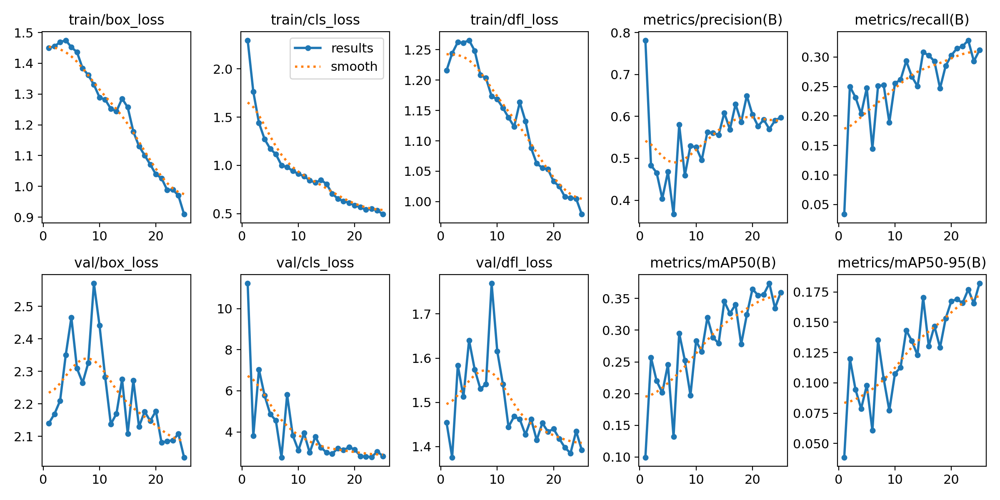
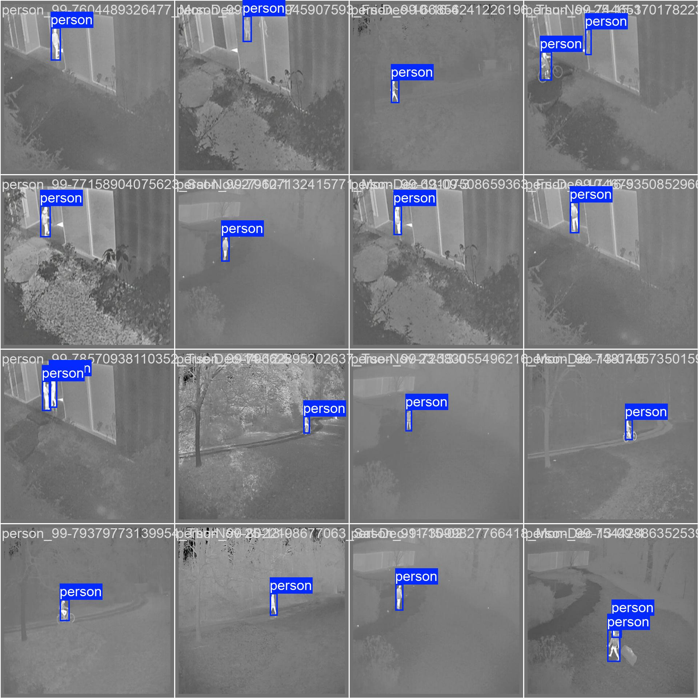

# [Sub-Module] Thermal Heat Signature Detection

## 🔍 Context in FYP
This repository section contains the AI development for the **Thermal Imaging Module**. It is designed to work alongside the LiDAR and Surface Crack detection systems to provide a multi-sensor safety and surveillance suite.

## Technical Implementation
* **Module Role:** Human detection and localization via heat signatures.
* **Model:** YOLOv8 Nano.
* **Training Environment:** Leveraged **Dual Tesla T4 GPUs** (Kaggle Cloud) using **Distributed Data Parallel (DDP)** to handle large-scale thermal data.
* **Dataset:** 50,000+ Thermal frames.

## 📊 Phase 1 Results (Pilot Run)
The initial training phase (25 epochs) was completed to verify the pipeline and feature extraction.
* **mAP50:** 0.359
* **Precision:** 0.598
* **Recall:** 0.311

### Performance Visualization
The following graphs and sample detections prove the model's ability to identify human targets in low-visibility thermal environments:

## 📁 Module Assets
* `best.pt`: Trained weights for integration into the main project.
* `results.png`: Convergence graphs (Loss vs. Epochs).
* `*.ipynb`: Training script and environment configuration.
